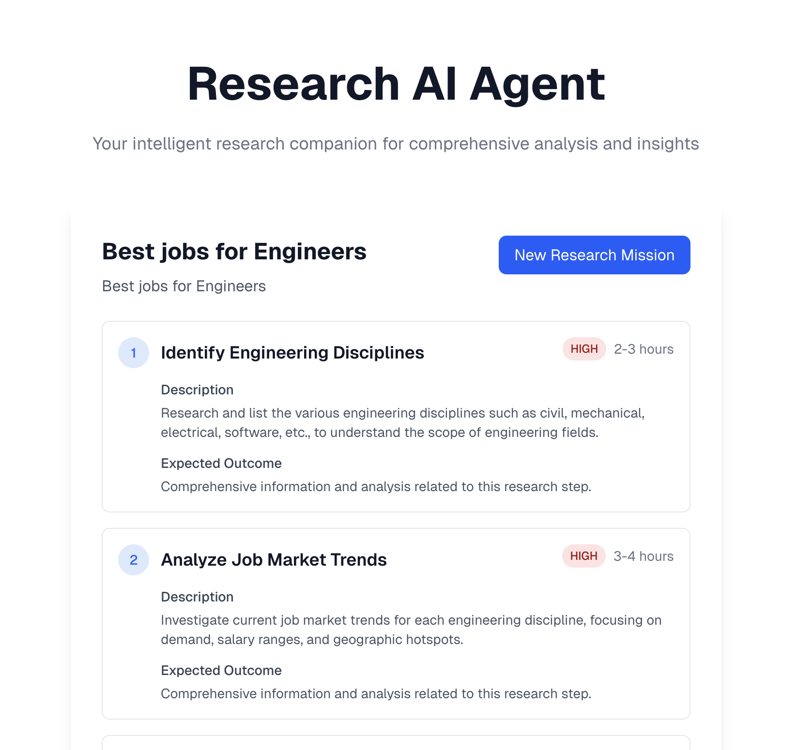

# 🔬 AI Research Agent

An intelligent research automation platform powered by AI that can analyze any topic, break it down into research steps, and compile comprehensive findings.



## ✨ Features

- **Intelligent Mission Planning**: Automatically breaks down research tasks into logical steps
- **Web Research Automation**: Uses OpenAI Web Search to gather information from across the web
- **Real-time Progress Tracking**: Watch your research unfold step by step
- **Comprehensive Results**: Get structured summaries, key findings, and source citations
- **Modern UI**: Clean, responsive interface built with Next.js and Tailwind CSS

## 🚀 Getting Started

### Prerequisites

- Node.js 18+ 
- npm or yarn
- OpenAI API key ([Get one here](https://platform.openai.com/api-keys))

### Installation

1. **Clone the repository**
   ```bash
   git clone <repository-url>
   cd deepresearch
   ```

2. **Install dependencies**
   ```bash
   npm install
   ```

3. **Set up environment variables**
   ```bash
   cp .env.example .env.local
   ```
   
   Edit `.env.local` and add your OpenAI API key:
   ```
   OPENAI_API_KEY=your_actual_api_key_here
   ```

4. **Start the development server**
   ```bash
   npm run dev
   ```

5. **Open your browser**
   Navigate to [http://localhost:3000](http://localhost:3000)

## 🎯 How to Use

1. **Start a Research Mission**
   - Enter a descriptive title for your research
   - Provide detailed information about what you want to research
   - Click "Start Research Mission"

2. **Monitor Progress**
   - Watch as the AI agent plans and executes research steps
   - See real-time updates on search queries and findings
   - Track completion status for each step

3. **Review Results**
   - Browse the comprehensive research summary
   - Explore key findings and insights
   - Access all source materials with relevance scores

## 📋 Example Research Missions

- **Technology Analysis**: "Research the current state of quantum computing, including recent breakthroughs, commercial applications, and future prospects"
- **Market Research**: "Analyze the electric vehicle market in 2024, including major players, market share, growth trends, and consumer adoption"
- **Industry Study**: "Investigate the impact of AI on healthcare, focusing on diagnostic tools, treatment optimization, and patient outcomes"

## 🛠️ Technical Architecture

### Core Components

- **Research Agent** (`/lib/agent.ts`): Main orchestration logic
- **Research Pipeline** (`/lib/research-pipeline.ts`): Step planning and execution
- **React Components**: Modern UI components for forms, progress tracking, and results

### API Endpoints

- `POST /api/research` - Start a new research mission
- `GET /api/research` - List all research missions
- `GET /api/research/[id]` - Get specific mission details
- `DELETE /api/research/[id]` - Cancel a research mission

### Key Features

- **Intelligent Step Planning**: Analyzes research topics to create optimal research workflows
- **Rate Limiting**: Built-in rate limiting for API calls
- **Error Handling**: Comprehensive error handling with retry logic
- **Progress Tracking**: Real-time updates on research progress
- **Result Synthesis**: Combines findings from multiple sources into coherent summaries

## 🔧 Configuration

### Environment Variables

| Variable | Description | Required |
|----------|-------------|----------|
| `NEXTAUTH_SECRET` | Secret for NextAuth (if using auth) | No |
| `NEXTAUTH_URL` | Base URL for your application | No |

### Customization Options

- **Search Depth**: Configure basic vs advanced search modes
- **Step Limits**: Adjust maximum number of research steps (3-7)
- **Result Limits**: Control number of sources per step
- **Rate Limiting**: Customize API call frequency

## 📚 API Documentation

### Starting a Research Mission

```typescript
POST /api/research
Content-Type: application/json

{
  "title": "Your Research Title",
  "description": "Detailed description of what you want to research"
}
```

### Getting Mission Status

```typescript
GET /api/research/{missionId}

Response:
{
  "success": true,
  "mission": { /* Mission object */ },
  "progress": 75,
  "isProcessing": true
}
```

## 🧪 Development

### Project Structure

```
src/
├── app/                    # Next.js app router
│   ├── api/               # API routes
│   ├── globals.css        # Global styles
│   ├── layout.tsx         # Root layout
│   └── page.tsx           # Main page
├── components/            # React components
│   ├── ResearchForm.tsx   # Mission input form
│   ├── ProgressTracker.tsx # Real-time progress
│   └── ResearchResults.tsx # Results display
└── lib/                   # Core logic
    ├── agent.ts           # Main agent orchestration
    ├── research-pipeline.ts # Research execution
    └── types.ts           # TypeScript definitions
```

### Running Tests

```bash
npm run test
```

### Building for Production

```bash
npm run build
npm start
```

## 🤝 Contributing

1. Fork the repository
2. Create a feature branch (`git checkout -b feature/amazing-feature`)
3. Commit your changes (`git commit -m 'Add some amazing feature'`)
4. Push to the branch (`git push origin feature/amazing-feature`)
5. Open a Pull Request

## 📄 License

This project is licensed under the MIT License - see the [LICENSE](LICENSE) file for details.

## 🙏 Acknowledgments

- [Next.js](https://nextjs.org) for the excellent React framework
- [Tailwind CSS](https://tailwindcss.com) for the utility-first CSS framework

## 🐛 Troubleshooting

### Common Issues

1. **API Key Issues**
2. **Build Errors**
   - Clear Next.js cache: `rm -rf .next`
   - Reinstall dependencies: `rm -rf node_modules && npm install`

### Getting Help

- Open an issue on GitHub
- Check the documentation
- Review existing issues and discussions
